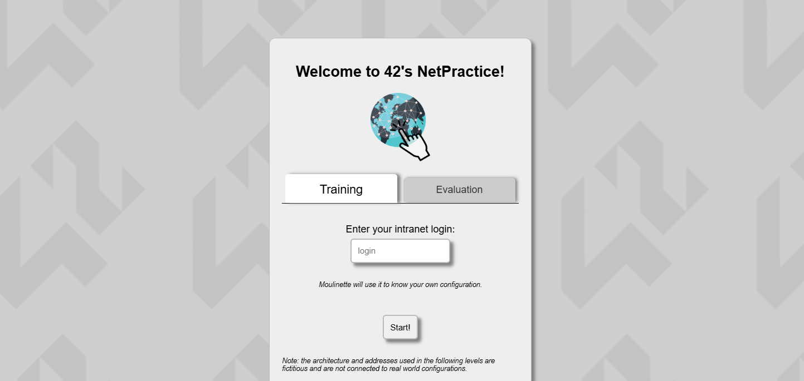
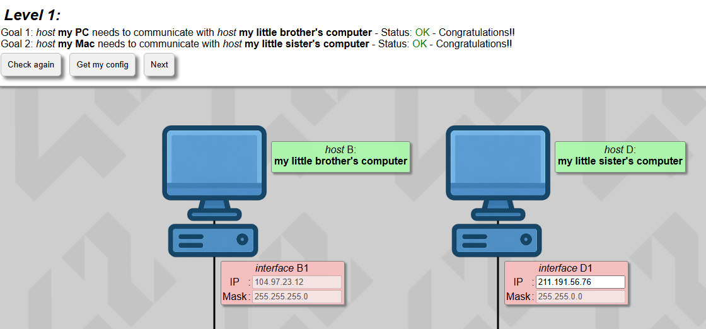
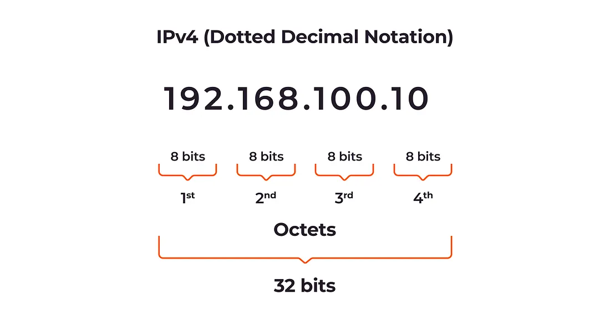
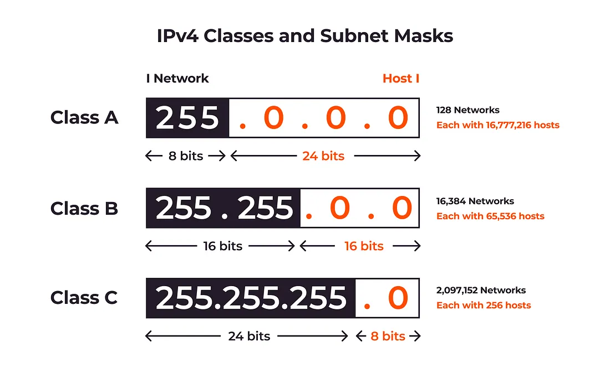

_This project has been created as part of the 42 curriculum by yelu_

# NetPractice

### Description

NetPractice is a project at 42 designed to provide a deep dive into the world of computer networking. The goal is to configure small-scale networks by solving a series of 10 levels that involve addressing, routing, and subnetting.

The project covers the fundamental logic of how devices communicate within a private network and how they reach the outside world (the Internet) through gateways. By the end of this project, I have gained understanding on how to manage IP ranges and ensure connectivity across multiple interfaces.

### Instructions

To begin the training interface:
1. Download net_practice.1.9.tgz attached to the project's page.
2. Extract into a folder of your choice.
3. Open your terminal in your project directory.
4. Run the training script: ```./run.sh ```.
5. This will launch a web interface in your browser where you can input configurations for each level. Type in your intra to begin.



6. Check your configurations through "Check again" to validate your answer. Once a level has been solved, click "Get my config" to fetch configuration files to be submitted.



7. During evaluation, the evaluation tab can be used. The evaluatee will have to successfully complete three random levels, as mentioned on the training platform. They will have a limited amount of time to do so.


### Resources

**OSI Model**: A conceptual framework used to understand network interactions in seven layers. In this project, we focus primarily on the Physical (Layer 1), Data Link (Layer 2), and Network (Layer 3) layers to manage how bits, frames, and packets move across the infrastructure.


In Level 1 (Physical), we learned how to connect interface to interface to establish a physical link.

In Level 2 (Data Link), we learned that devices on the same segment communicate via MAC addresses and do not need a router.

In Level 3 (Network), we learned how to calculate IP Addresses, Subnet masks and how to use Routing Tables. 

Level 4 is about TCP and UDP ports while level 5, 6 and 7 are handled by the software we use such as web browsers.

**TCP/IP Addressing**: TCP/IP Addressing is a suite of protocols that defines how data is labeled and transported across networks. IP provides the logical address used to route packets to their destination, while TCP ensures the reliable, ordered delivery of those packets through error-checking and flow control.

**Subnet Masks**: A 32-bit number that "masks" an IP address to divide it into network and host portions. It defines the size of the network (e.g., /24 or 255.255.255.0) and determines which IP addresses belong to the same local segment and which require a router to reach.





**Default Gateways**: The "exit point" or access point that a local network uses to send information to devices in other networks or the internet. Without a correctly configured gateway, a device can only communicate with others on its own subnet.

**Routers vs Switches**: Switches facilitate communication within a single network (using MAC addresses), while routers facilitate communication between different networks (using IP addresses). A switch connects multiple devices together, whereas a router connects multiple switches/networks together.

### Submission Details

All 10 exported configuration files must be submitted into the root repository folder. It is important to enter your login in the interface to fetch the configuration files correctly. 


### References

[Subnet Cheat Sheet](https://www.aelius.com/njh/subnet_sheet.html) - For quick CIDR to Subnet Mask conversions.

[Networking Fundamentals](https://www.youtube.com/playlist?list=PLIFyRwBY_4bRLmKfP1KnZA6rZbRHtxmXi) - Videos for understanding various networking devices, OSI Models, Hosts and Network protocols

[NetPractice by Sheldon Chong](https://github.com/Sheldon-Chong/netpractice) - Explanation of this 42 project

[OSI Model](https://datageneral.co/osi-model/) - Explanation of OSI Model

[Subnet](https://infosecwriteups.com/subnetting-101-simple-guide-to-ip-addressing-0a1ecac6a0ef) - Subnetting 101: Simple Guide to IP Addressing

##### Use of Artificial Intelligence

AI (Gemini) was used during this project for the following tasks:
- Conceptual Clarification: Explaining and clarifying the different concepts of networking, such as OSI model, hosts, subnet masks.
- Subnet Calculation: Learning the different formulas for calculating subnet masks and IP Adresses